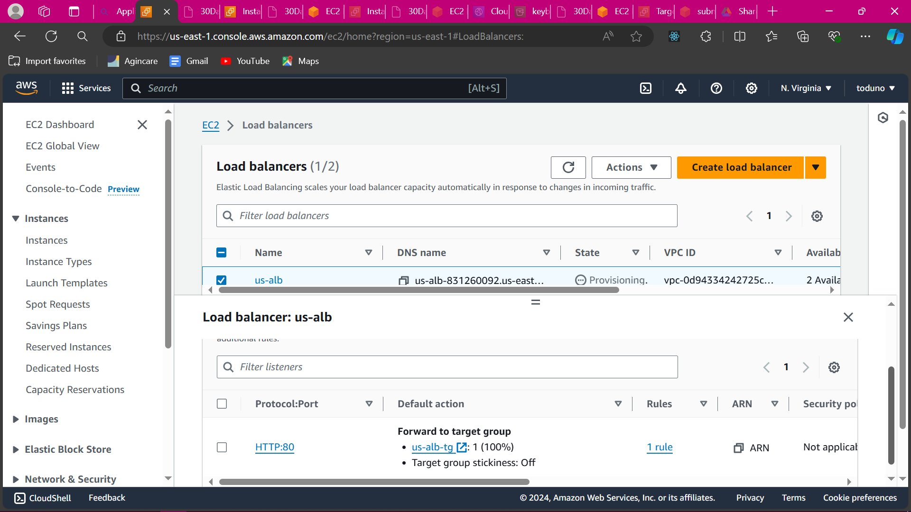
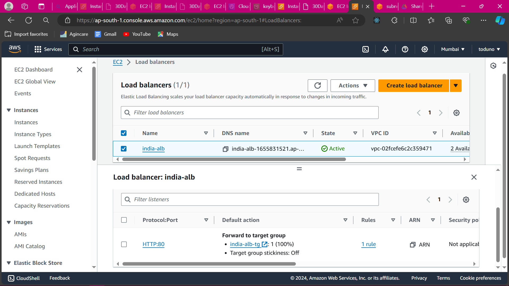
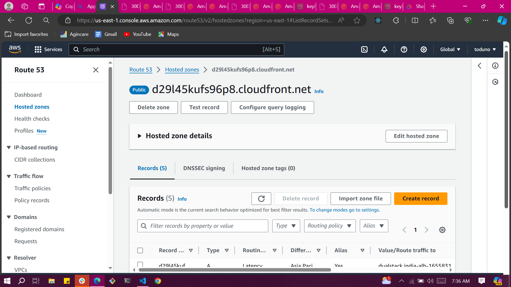
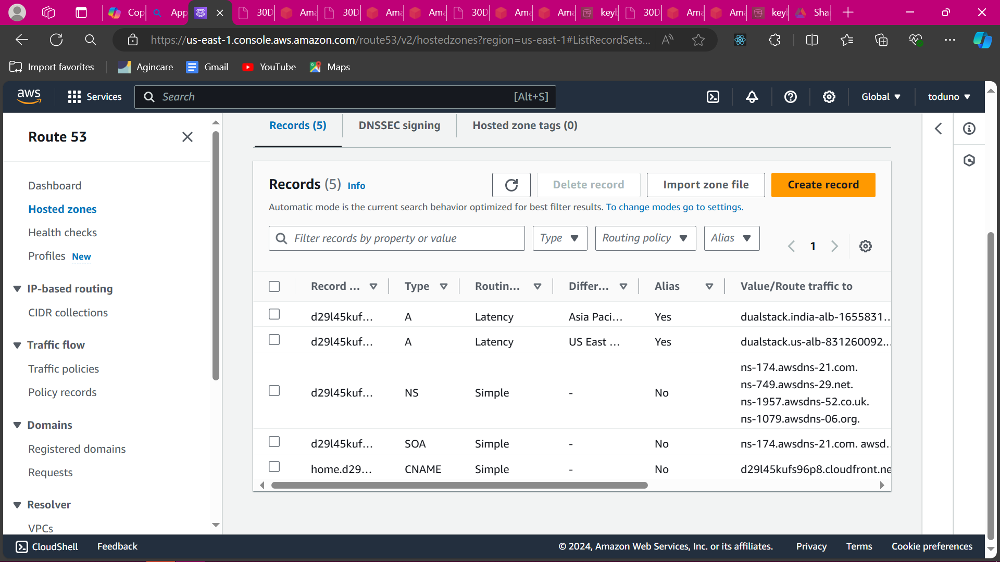
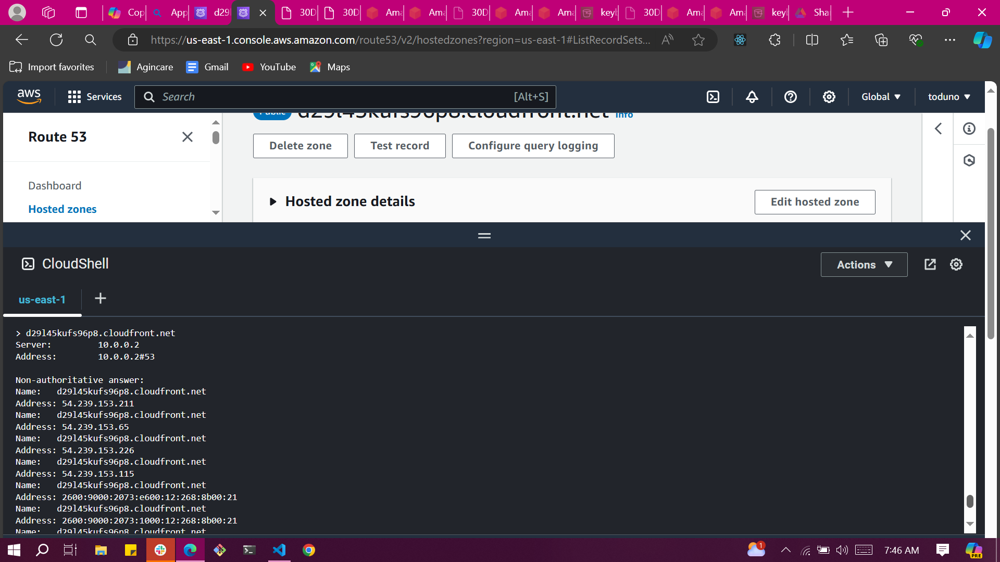
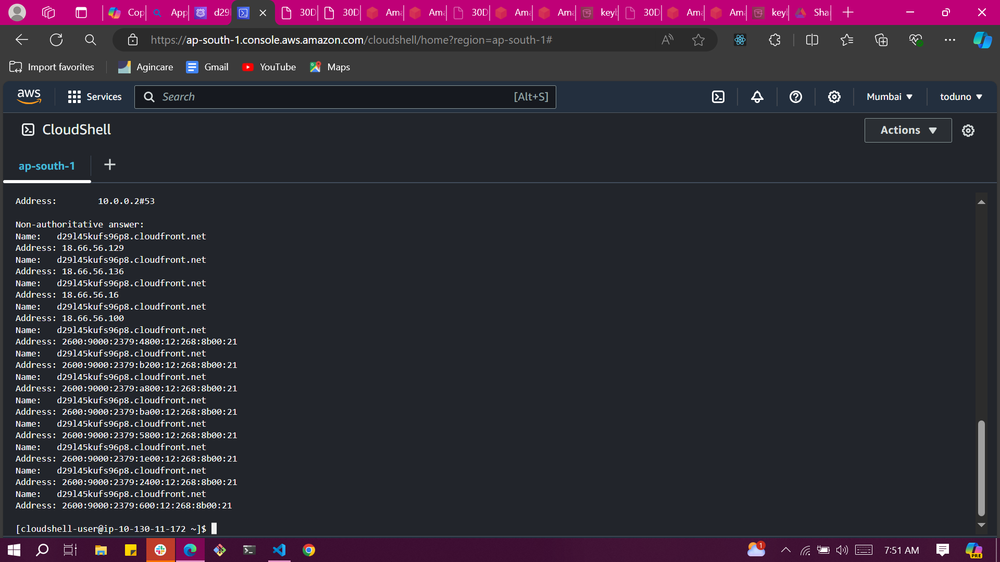
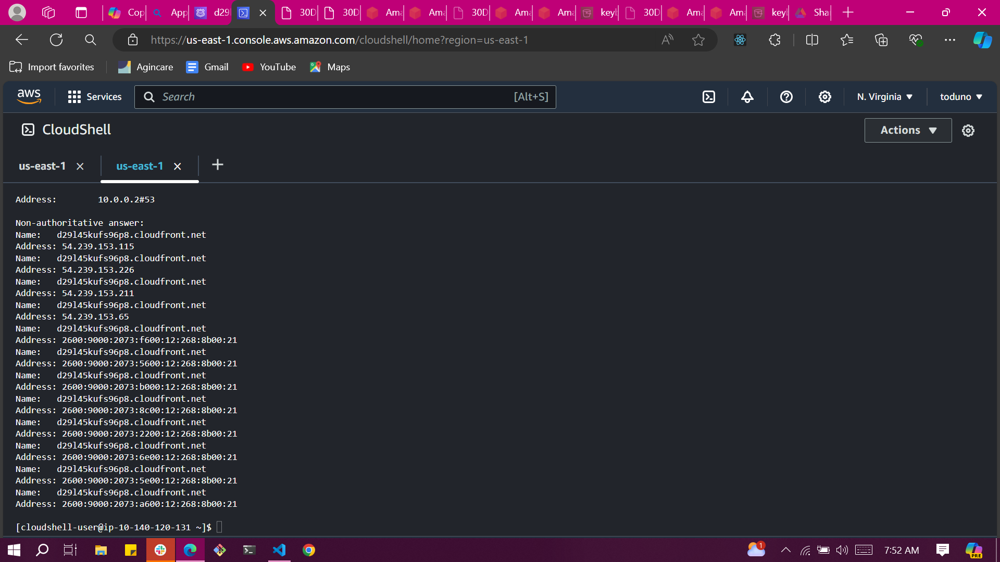
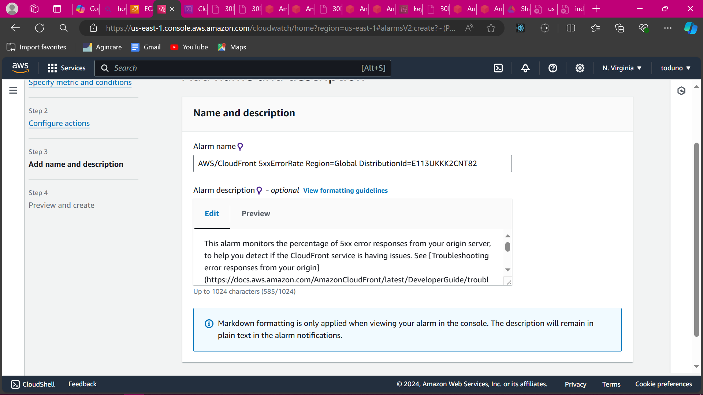
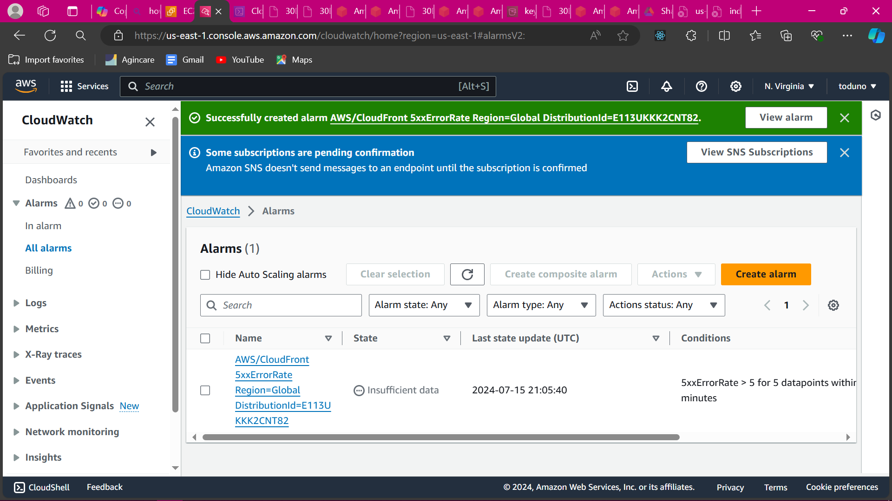

# **Optimizing Performance and Minimizing Latency for Users in India and London Project**

## Scenario 1

As a senior DevOps engineer, you are tasked with designing a solution to ensure users in two different geographical locations, India and London, have a good browsing experience with minimal latency. Create an infrastructure solution that optimizes performance and minimizes latency for users in both regions. Consider factors such as content delivery networks (CDNs), edge caching, global load balancing, and region-specific deployment strategies to achieve this goal effectively. After designing the solutions(use draw.io), implement them and create the infrastructure in your AWS console

## Infrastructure Design

### 1. Content Delivery Networks (CDNs)

- Deploy a CDN that caches static content (images, CSS, JavaScript) at edge locations close to users.
- Consider using reputable CDN providers like Amazon CloudFront.

### 2. Edge Caching

- Implement edge caching mechanisms to store frequently accessed content closer to users like Amazon CloudFront Caching: Configure CloudFront to cache frequently accessed content, reducing load on origin servers.
- Explore learning-based caching frameworks like HR-Cache¹ or ECC (Edge Collaborative Caching)². These techniques optimize cache eviction decisions based on request patterns and object sizes.*
  
### 3. Global Load Balancing

- Set up global load balancers to distribute user requests across multiple data centers or regions.
- Use Amazon Route 53 with latency-based routing to direct users to the nearest AWS region based on their location.
  
### 4. Region-Specific Deployment Strategies

- Deploy application instances in both India and London regions.
- Use AWS Auto Scaling to dynamically adjust the number of instances based on demand.*
- Implement blue-green deployments or canary releases to minimize downtime during updates.*

## AWS Infrastructure Implementation Steps

1. **Amazon S3 and CloudFront**:

- Create an Amazon **S3 bucket** to store static assets (images, CSS, etc.).
- Configure the **bucket permissions** to allow public read access by:
  
  - Disabling or unchecking all the boxes in the _"Block Public Access (bucket settings)"_ section

  - Creating a _bucket policy_ that allows public read access (on all objects in the bucket by all)

      ```json
      {
        "Version": "2012-10-17",
        "Statement": [
            {
              "Effect": "Allow",
              "Principal": "*",
              "Action": ["s3:GetObject"],
              "Resource": "arn:aws:s3:::keyboard-gen/*"
            }
        ]
      }
      ```

<br>

  

- Set up an Amazon _CloudFront distribution with the S3 bucket as the origin_. Configure behaviors (e.g., TTL, cache policies) in CloudFront to optimize caching.
- Once the distribution is created, note down the CloudFront domain name (e.g., d123456789abcdef.cloudfront.net) and _update your DNS records_ (e.g., in Route 53, CNAME preferably if already existing) to point to this CloudFront domain name. If not, create a hosted zone for your domain and create a CNAME record (with simple routing) or an alias record pointing to the CloudFront distribution.
  <br>

  
  
  
2. **EC2 Instances and ELB**:

- Launch EC2 instances in both the India and London regions (e.g. 2 in each regions).
- Install and configure your application on these instances:
  - Install a web server (e.g., Apache or Nginx) using package manager commands (e.g., `sudo yum install httpd` for Amazon Linux). Also, ensure **aws cli** is installed which should by default using `aws --version` to confirm as this would be used to interact with aws to copy your objects in your s3 bucket to the ec2.
  - Create a directory for your website content (e.g., /var/www/html). (By default Apache serves files from this directory so it should exist already).
  - Upload your static website files (HTML, CSS, JS) to this directory using `aws s3 cp s3://your-bucket-name/ /path/to/your/website-directory/` command after verifying that the EC2 instance has the correct IAM role attached (e.g. S3ReadOnlyAccess or S3FullAccess) and the AWS CLI is working properly with `aws sts get-caller-identity`. Else, you create IAM role for EC2 with S3 access and attach the IAM role to the EC2 instance. If the above aws cli `cp` command doesn't work (which didn't) then use the `sync` command i.e. `aws s3 sync s3://your-bucket-name/your-folder-name /var/www/html` to recursively copy all files and subdirectories from the specified S3 folder to /var/www/html. Another alternative: to use `wget` command (which downloads files from anywhere) to download files from S3 to ec2 and then copy/move it to the preferred ec2 directory e.g. /var/www/html e.g. `wget --no-check-certificate --no-proxy '<your-bucket-link>'` or `wget https://s3-bucket-url`.
  - Configure the web server to serve these files (e.g., create a virtual host in Apache) from the specified directory. Since we're using Amazon Linux AMI for the ec2 which works with httpd as Apache, edit the Apache configuration file (/etc/httpd/conf/httpd.conf) by setting the DocumentRoot to the mounted directory (e.g., /var/www/html).
  - Restart or start the web server and ensure it’s running: `sudo service httpd restart`.
  - Test by accessing the public IP or DNS of each instance in a web browser.
- Set up an Application Load Balancer (ALB) or Network Load Balancer (NLB) in each region.
- Register your EC2 instances with the load balancers (via target group). Test the load balancer is working by sending traffic to your load balancer using the DNS name provided by the ELB and observe the distribution of requests across your registered instances. The load balancer should evenly distribute traffic.
<br>

     <br>
    

3. **Amazon Route 53**:

- Create a new hosted zone in Amazon Route 53.
- Add latency-based routing records for your domain, directing traffic to the appropriate load balancer based on user location. Use `nslookup` to verify your domain resolves to the correct load balncer based on user location i.e. `nslookup yourdomain.com`. The output should display the IP addresses associated with your domain and ensuring it matches the expected load balancer IP for the specific region. Note: if you don't hav `nslookup`, you can get via installing `dnsutils` package which includes it.
<br>

      <br>
    

4. **Monitoring and Optimization**:

- Use Amazon CloudWatch to monitor performance metrics (e.g., latency, request rates). EXample: enable detailed monitoring for resources like EC2 instances to get more frequen metric data, create new alarm(s) based on needs by choosing a metric, set your threshold, define the period and specify the action (e.g. SNS notification).
  <br>
  
   

- Adjust TTLs and cache policies in CloudFront as needed e.g. use CachingOptimized cache policy which is policy with caching enabled and TTL set to default recommended for S3, or create a new one and manually set TTL.
- Regularly review logs and metrics to optimize your setup.
