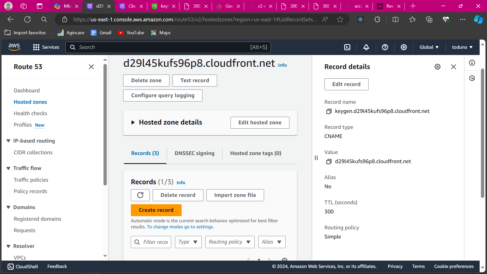
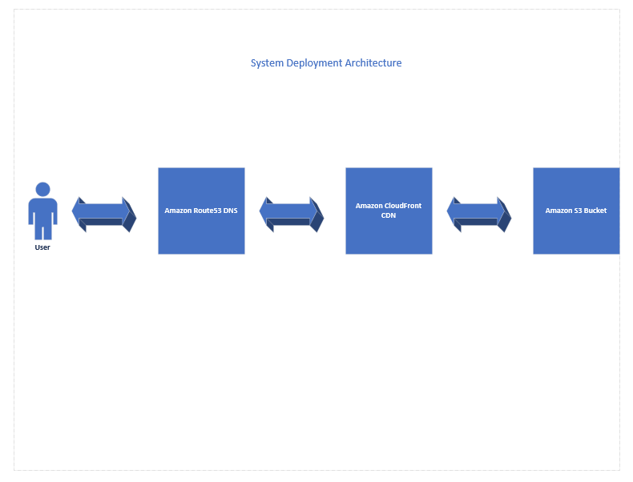

# **Hosting a Static Website on Amazon S3**

## Scenario 2

As a junior DevOps engineer, explain how you would host a static website in an Amazon S3 bucket. Describe the steps in **configuring the S3 bucket for website hosting, uploading the static website files, setting permissions, and enabling static website hosting**. Additionally, discuss any considerations for **domain configuration and CDN integration** to enhance website performance. After proper research, provide an architectural diagram and host a sample static website in an Amazon S3 Bucket following the solutions and steps you have come up with.

### Step 1: Create an S3 Bucket

- Sign in to the AWS Management Console and open the [Amazon S3 console](https://console.aws.amazon.com/s3/).
- Choose "Create bucket."
- Enter a unique bucket name (e.g., `keyboard-gen`).
- Select a region close to your users for low latency.
- Accept the default settings and create the bucket.

### Step 2: Enable Static Website Hosting

- Select bucket.
- Go to Properties > Static Website Hosting.
- Set index document (e.g., `index.html`).
- Save the changes.

### Step 3: Add a Bucket Policy

- Create a bucket policy that allows public read access (on all objects in the bucket by all):
      ```json
      {
         "Version": "2012-10-17",
         "Statement": [
            {
               "Effect": "Allow",
               "Principal": "*",
               "Action": ["s3:GetObject"],
               "Resource": "arn:aws:s3:::keyboard-gen/*"
            }
         ]
      }
      ```


### Step 4: Upload Your Website Files

- Use AWS CLI or S3 console to upload your static website files (HTML, CSS, JS, images) to the bucket. Ensure that your index page (e.g., index.html) is at the root of the bucket.
- Set the correct content type for each file (e.g., `text/html`, `text/css`, `application/javascript`).

### Step 5: Configure DNS and CDN

- **Domain Configuration**:
  - Create a DNS record (A or CNAME) pointing to your S3 website endpoint (e.g., `example.com` -> S3 endpoint).
  - Consider using Route 53 for domain management.
- **CDN Integration**:
  - Use Amazon CloudFront to enhance performance:
    - Create a CloudFront distribution with your S3 bucket as the origin.
    - Configure HTTPS (SSL/TLS) for secure communication: Use AWS Certificate Manager (ACM) to create an SSL/TLS certificate for your domain if not done (optional but recommended). Then, in Viewer Protocol Policy: Choose “Redirect HTTP to HTTPS”. In Alternate Domain Names (CNAMEs): Enter your domain name (e.g., example.com). For Custom SSL Certificate: Choose the certificate you created.
    - Set caching behavior and TTLs.
    - Update your DNS record to point to the CloudFront distribution (like above but pointing to the Cloudfront distribution URL).




## Sample Architectural Diagram

Here's a simplified diagram of the setup:

```markdown
User Browser <-> CloudFront <-> S3 Bucket (keyboard-gen)
```


